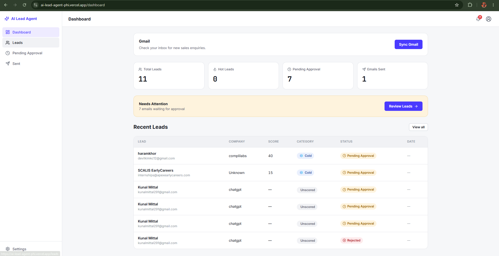
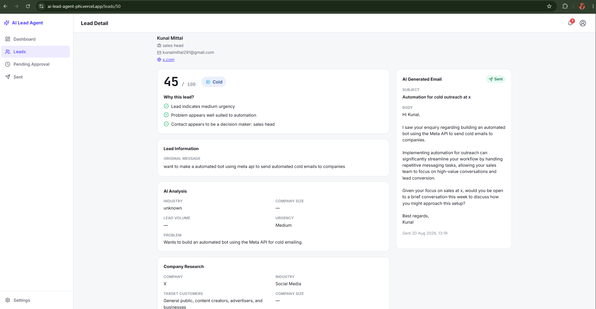
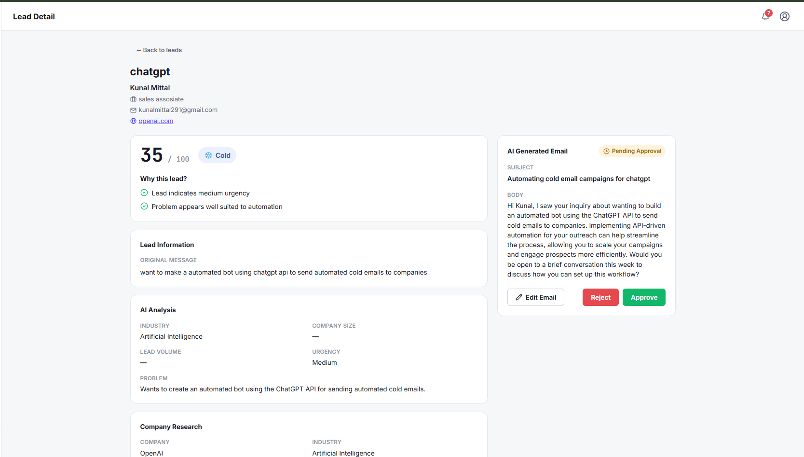
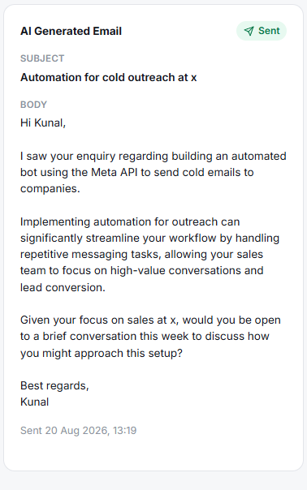
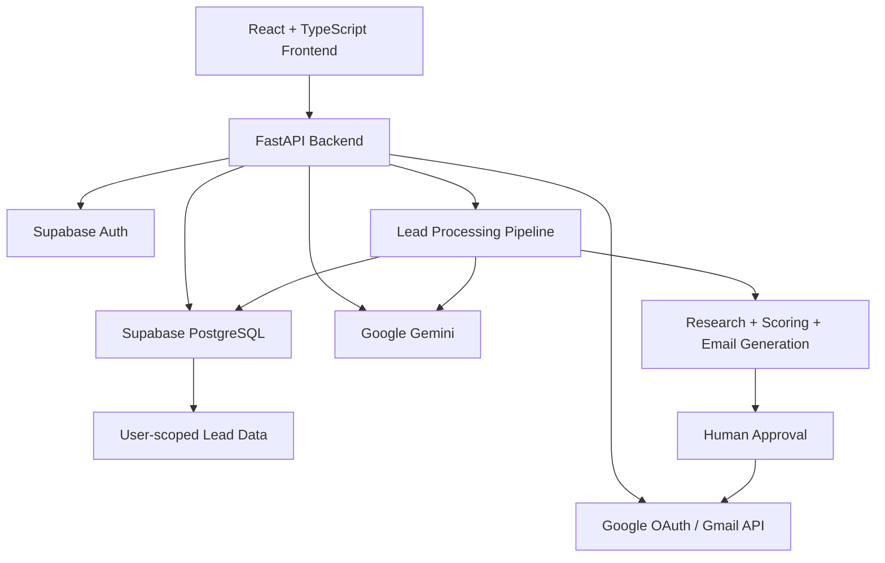

# AI Lead Agent

<p align="center"><strong>AI-powered lead research, scoring, and sales outreach automation.</strong></p>

<p align="center">
  Turn inbound enquiries into researched, scored, personalized, and human-approved sales opportunities.
</p>

<p align="center">
  <a href="https://ai-lead-agent-phi.vercel.app/"></a>
  <a href="https://github.com/KunalSenpai/AI-Lead-Agent/archive/refs/heads/main.zip"></a>
</p>

## Overview

AI Lead Agent is a full-stack sales automation application that combines AI-powered lead intelligence with a human approval workflow and Gmail integration.

The application can:

1. Ingest inbound leads.
2. Analyze the lead's intent and business problem.
3. Research the associated company.
4. Score and categorize the opportunity.
5. Generate a personalized sales email.
6. Let a human edit, approve, or reject the email.
7. Send approved emails through Gmail.
8. Track the resulting email status.

## Product Screenshots

### 1. Leads Dashboard

<!-- INSERT SCREENSHOT HERE: docs/screenshots/01-dashboard.png -->
<!-- SOURCE SCREENSHOT: 02-leads-dashboard.png -->



The dashboard provides an overview of leads, scoring, approval status, sent emails, and Gmail synchronization.

### 2. AI Lead Intelligence

<!-- INSERT SCREENSHOT HERE: docs/screenshots/02-ai-analysis.png -->
<!-- SOURCE SCREENSHOT: 03-ai-lead-analysis.png -->



Each lead can be analyzed, scored, and researched automatically. The lead detail view combines the original enquiry, AI analysis, scoring reasons, company research, and generated outreach.

### 3. Human-in-the-Loop Email Approval

<!-- INSERT SCREENSHOT HERE: docs/screenshots/03-email-approval.png -->
<!-- SOURCE SCREENSHOT: 04-email-approval.png -->



Generated emails can be reviewed and edited before sending. The approval workflow prevents AI-generated outreach from being sent without human confirmation.

### 4. Gmail Email Delivery

<!-- INSERT SCREENSHOT HERE: docs/screenshots/04-email-sent.png -->
<!-- SOURCE SCREENSHOT: 06-email-sent.png -->



Once approved, the email is sent through Gmail and the lead is updated with its sent status and message information.

## Workflow

```text
Inbound Lead
     |
     v
AI Analysis
     |
     v
Company Research
     |
     v
Lead Scoring
     |
     v
Email Generation
     |
     v
Human Approval
   /     \
Reject   Approve
            |
            v
          Gmail
            |
            v
           Sent
```

## Architecture



## Key Features

- Supabase authentication
- User-isolated lead data with PostgreSQL/RLS
- AI-powered lead analysis and scoring
- Automated company research
- AI-generated personalized sales emails
- Human approval workflow before sending
- Gmail OAuth integration
- Gmail inbox synchronization
- Duplicate email-send protection
- FastAPI backend + React frontend
- Automated test suite

## Tech Stack

| Layer | Technologies |
|---|---|
| Frontend | React, TypeScript, Vite |
| Backend | Python, FastAPI, Pydantic |
| AI | Google Gemini |
| Database | Supabase, PostgreSQL |
| Authentication | Supabase Auth |
| Security | Row-Level Security (RLS) |
| Email | Gmail API, Google OAuth |
| Frontend Deployment | Vercel |
| Backend Deployment | Render |

## Production

### Frontend

<a href="https://ai-lead-agent-phi.vercel.app/"></a>

https://ai-lead-agent-phi.vercel.app/

### Backend

https://ai-lead-agent-kibe.onrender.com/

## Security

- Authenticated API access
- User-scoped lead queries
- Supabase Row-Level Security
- Privileged Supabase service-role operations restricted to the backend
- Google OAuth for Gmail access
- No credentials committed to source control
- Duplicate email-send protection
- Gmail sending requires an approved email workflow

## Local Development

### Clone

```bash
git clone https://github.com/KunalSenpai/AI-Lead-Agent.git
cd AI-Lead-Agent
```

### Backend

```powershell
python -m venv .venv
.venv\Scripts\Activate.ps1
pip install -r requirements.txt
uvicorn app.main:app --reload
```

Configure the required environment variables for Supabase, Gemini, and Google OAuth/Gmail.

### Frontend

```powershell
cd frontend
npm install
npm run dev
```

## Testing

Run:

```powershell
pytest -q
```

Current verified status:

```text
68 passed
```

`test_genai.py` performs a live Gemini API request, so its result depends on external API/network availability.

## Project Structure

```text
AI-Lead-Agent/
├── app/
│   ├── api/
│   ├── core/
│   ├── services/
│   ├── tools/
│   └── main.py
├── frontend/
├── tests/
├── DockerFile
├── requirements.txt
├── test_genai.py
├── test_gmail_connection.py
└── README.md
```

## Why I Built This

This project demonstrates practical AI application engineering across a complete production workflow:

- full-stack development
- AI-powered automation
- multi-user authentication
- database security and RLS
- OAuth integrations
- external APIs
- structured AI pipelines
- human-in-the-loop workflows
- automated testing
- production deployment

The design deliberately keeps a human approval step between AI-generated outreach and Gmail delivery.

## License

This project is intended as a portfolio project.
